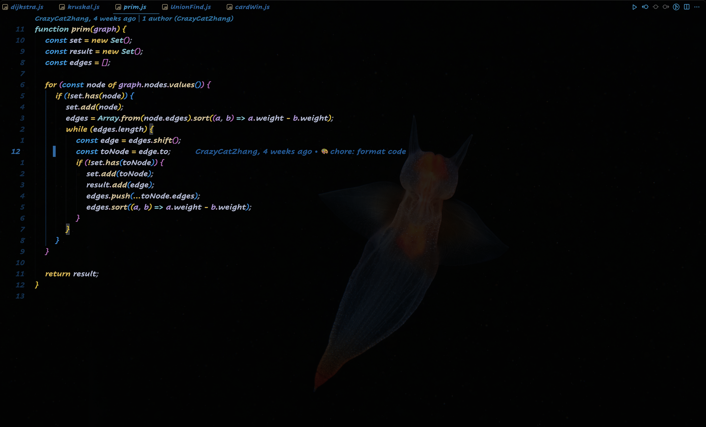
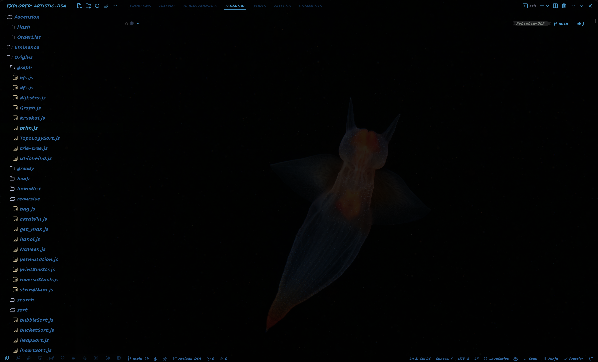
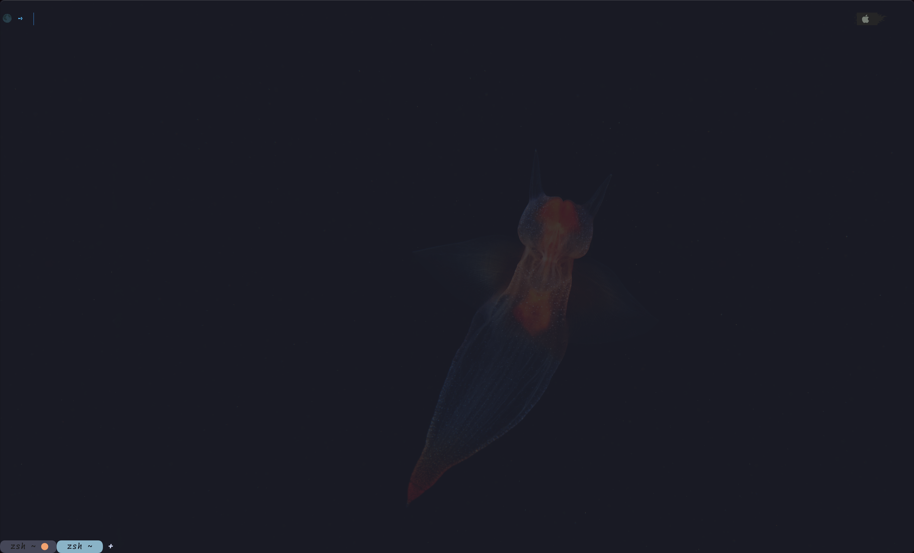
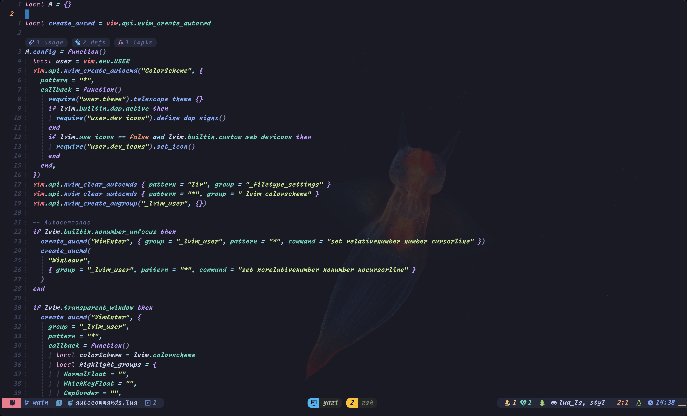
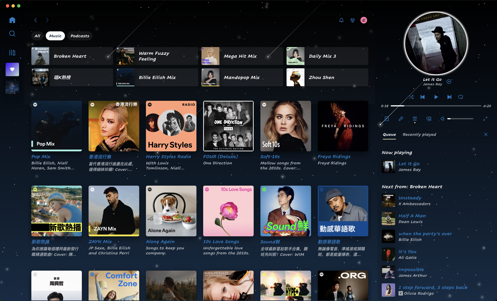
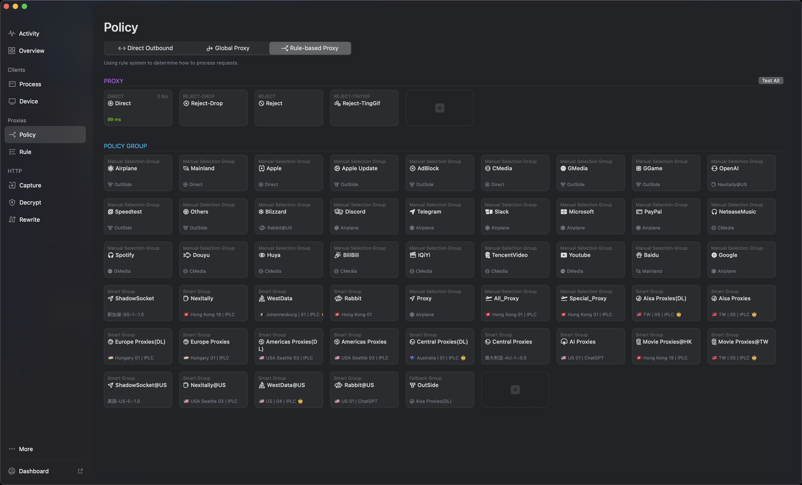

# dotfiles

My macOS configuration files playground...

## Quick Start

Most setup steps are in .install.sh

```bash
curl -L https://raw.githubusercontent.com/CassandraCat/dotfiles/main/.install.sh | sh
```

## Screenshot

### vscode




### wezterm




### tmux


### nvim



### spotify



### discord


### sketchybar


### surge


